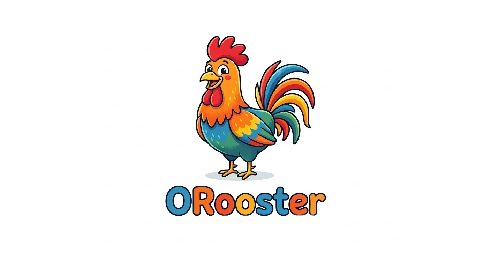

<p align="center">
  
</p>

<h1 align="center">ORooster</h1>

<p align="center">
  A native, lightweight desktop UI for <a href="https://ollama.com">Ollama</a> — built with Tauri, React, and Rust.
</p>

<p align="center">
  
  
  
</p>

---

## About

ORooster is a native Linux desktop client for [Ollama](https://ollama.com). It provides a clean, fast chat interface to interact with locally-running LLMs — no browser required.

Unlike web-based UIs, ORooster runs as a lightweight native app (~13 MB) with system tray integration, streaming responses, and automatic dark/light theme support.

## Features

- **Streaming chat** — real-time token-by-token response rendering
- **Model selector** — switch between installed Ollama models
- **Markdown rendering** — code blocks with syntax highlighting, tables, lists, blockquotes
- **System tray** — minimize to tray, click to restore, right-click menu
- **Dark/light theme** — follows your system preference automatically
- **Connection status** — live indicator showing Ollama daemon status
- **Splash screen** — branded launch screen with ORooster logo
- **Copy messages** — hover over assistant messages to copy content
- **Lightweight** — ~13 MB binary, minimal resource usage

## Screenshots

<!-- Add screenshots here -->

## Prerequisites

- [Ollama](https://ollama.com/download) installed and running (`ollama serve`)
- At least one model pulled (e.g., `ollama pull llama3`)

## Installation

### Pre-built packages

Download the latest release from the [Releases](https://github.com/YOUR_USERNAME/orooster/releases) page:

- **`.deb`** — for Ubuntu/Debian
- **`.rpm`** — for Fedora/RHEL

### Build from source

#### System dependencies (Ubuntu/Debian)

```bash
sudo apt install -y \
  pkg-config libssl-dev libglib2.0-dev libgtk-3-dev \
  libjavascriptcoregtk-4.1-dev libsoup-3.0-dev libwebkit2gtk-4.1-dev \
  libayatana-appindicator3-dev librsvg2-dev
```

#### Build tools

- [Rust](https://rustup.rs/) (1.77.2+)
- [Node.js](https://nodejs.org/) (v18+)

#### Steps

```bash
# Clone the repository
git clone https://github.com/YOUR_USERNAME/orooster.git
cd orooster

# Install frontend dependencies
npm install

# Run in development mode (with hot-reload)
npx tauri dev

# Build for production
npx tauri build
```

Build artifacts will be in `src-tauri/target/release/bundle/`.

## Tech Stack

| Layer | Technology |
|---|---|
| **Desktop shell** | [Tauri v2](https://tauri.app) |
| **Frontend** | React 19 + TypeScript |
| **Styling** | Tailwind CSS 4 |
| **Backend** | Rust (reqwest + tokio for async streaming) |
| **Markdown** | react-markdown + rehype-highlight |
| **Icons** | Lucide React |

## Project Structure

```
orooster/
├── src/                      # Frontend (React + TypeScript)
│   ├── components/           # UI components
│   │   ├── ChatView.tsx      # Main chat area
│   │   ├── MessageBubble.tsx # Chat message with markdown
│   │   ├── InputBar.tsx      # Message input
│   │   ├── ModelSelector.tsx # Model dropdown
│   │   └── StatusIndicator.tsx
│   ├── hooks/                # React hooks
│   │   ├── useChat.ts        # Chat logic + streaming
│   │   ├── useModels.ts      # Model management
│   │   └── useConnection.ts  # Ollama connection check
│   ├── lib/types.ts          # TypeScript types
│   └── App.tsx               # Main app layout
├── src-tauri/                # Rust backend
│   ├── src/
│   │   ├── lib.rs            # Tauri commands + system tray
│   │   ├── ollama.rs         # Ollama API client (streaming)
│   │   └── main.rs           # Entry point
│   ├── icons/                # App icons
│   └── Cargo.toml
├── public/splash/            # Splash screen assets
└── package.json
```

## Roadmap

- [x] Chat with streaming responses
- [x] Model selection
- [x] Connection status indicator
- [x] System tray integration
- [x] Dark/light theme
- [x] Markdown + code highlighting
- [x] Splash screen
- [ ] Conversation history (SQLite persistence)
- [ ] Multiple conversations with sidebar
- [ ] System prompt editor
- [ ] Model management (pull/delete)
- [ ] Image input for multimodal models
- [ ] Modelfile editor
- [ ] Export conversations as Markdown/JSON
- [ ] Keyboard shortcuts
- [ ] Context window (num_ctx) configuration

## Contributing

Contributions are welcome! Please feel free to submit a Pull Request.

1. Fork the repository
2. Create your feature branch (`git checkout -b feature/amazing-feature`)
3. Commit your changes (`git commit -m 'Add amazing feature'`)
4. Push to the branch (`git push origin feature/amazing-feature`)
5. Open a Pull Request

## License

This project is licensed under the MIT License — see the [LICENSE](LICENSE) file for details.

## Acknowledgments

- [Ollama](https://ollama.com) — for making local LLMs accessible
- [Tauri](https://tauri.app) — for the lightweight native app framework
- [Meta AI](https://ai.meta.com) — for the open LLaMA model family
